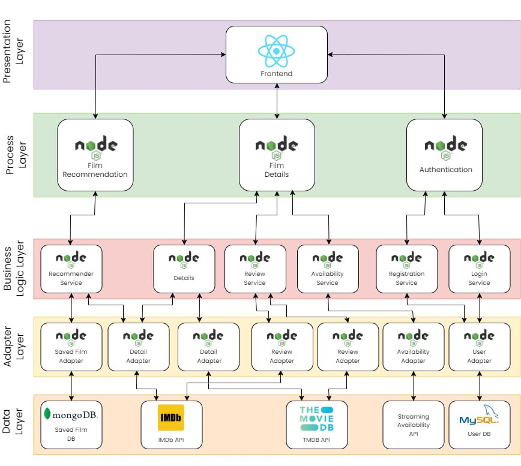

# SDE_Film_Recommendation [service design and engineering 23/24]

The goal for this project was to provide users with a comprehensive overview of a film by aggregating information from various sources. Recognizing that different platforms may contain different data about the same movie. Additionally, to mitigate bias, we offered a rating score based on multiple review system sources and averaged the result. Lastly, our platform also offers film recommendations based on users preferences and maintaining a history of recommended films for future viewing.



# How to run
To run this application Docker and Docker compose are required.
Set the env variable in the .env file,
Then run the following command in the root directory of this project:
```
docker-compose up --build
```
The web interface will be available at http://localhost (on port 3000).

